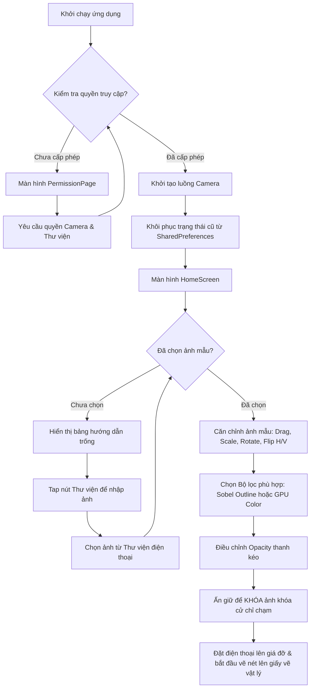
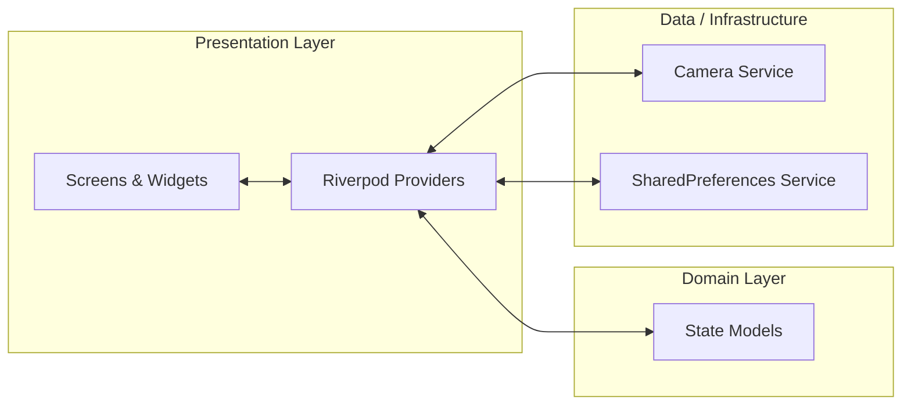

# 🎨 Camera Trace — Trợ Thủ Đắc Lực Cho Vẽ Truyền Thần & Can Nét (Trace Drawing)

> Một ứng dụng di động được xây dựng bằng **Flutter (Dart 3)** hỗ trợ các họa sĩ, người học vẽ và nhà thiết kế thực hiện phác họa, can nét ảnh mẫu (tracing) trực tiếp lên giấy thông qua camera thời gian thực của thiết bị.

<p align="center">
  
  
  
  
  
</p>

---

## 📌 Mục lục

1. [📖 Tổng quan dự án](#-tong-quan-du-an)
2. [✨ Tính năng nổi bật](#-tinh-nang-noi-bat)
3. [⚙️ Cử chỉ tương tác (Gestures)](#%EF%B8%8F-cu-chi-tuong-tac-gestures)
4. [🎨 Các bộ lọc hình ảnh nâng cao (Filters)](#-cac-bo-loc-hinh-anh-nang-cao-filters)
5. [🔄 Quy trình hoạt động (Workflow)](#-quy-trinh-hoat-dong-workflow)
6. [🏗️ Kiến trúc & Cấu trúc thư mục](#%EF%B8%8F-kien-truc--cau-truc-thu-muc)
7. [🛠️ Công nghệ & Thư viện sử dụng](#%EF%B8%8F-cong-nghe--thu-vien-su-dung)
8. [🚀 Cài đặt & Khởi chạy](#-cai-dat--khoi-chay)
9. [🗺️ Lộ trình phát triển (Roadmap)](#%EF%B8%8F-lo-trinh-phat-trien-roadmap)
10. [📄 Giấy phép (License)](#-giay-phep-license)

---

## 📖 Tổng quan dự án

**Camera Trace** giải quyết một thách thức lớn của những người học vẽ hoặc họa sĩ truyền thần: làm sao để dựng hình một bức ảnh mẫu lên giấy vẽ một cách chính xác nhất về mặt tỷ lệ mà không cần các máy chiếu cồng kềnh.

Ứng dụng hoạt động theo cơ chế **Overlay thời gian thực**:
* Camera phía sau sẽ thu hình ảnh của giấy vẽ và bút vẽ thật của bạn.
* Một ảnh mẫu (được chọn từ thư viện điện thoại) sẽ được phủ (overlay) lên trên màn hình camera.
* Người dùng căn chỉnh độ mờ (opacity), vị trí, kích thước và góc xoay của ảnh mẫu cho khớp với khổ giấy thực tế bên ngoài.
* Bằng cách nhìn qua màn hình điện thoại, bạn có thể dễ dàng đi nét (trace) chính xác từng chi tiết lên giấy vẽ vật lý.

---

## ✨ Tính năng nổi bật

* 📷 **Live Camera Preview**: Luồng camera thời gian thực mượt mà, hỗ trợ bật/tắt linh hoạt giữa camera trước và camera sau.
* 🖼️ **Nhập ảnh linh hoạt**: Cho phép chọn ảnh mẫu định dạng PNG, JPEG, WEBP trực tiếp từ thư viện ảnh của máy.
* 🕒 **Lịch sử ảnh mẫu (Image History)**: Tự động ghi nhớ danh sách lên tới 15 hình ảnh được nhập gần nhất giúp chuyển đổi qua lại nhanh chóng.
* 📐 **Lưới căn bố cục (Composition Grid)**: Hiển thị lưới 3x3 (quy tắc một phần ba) giúp căn chỉnh ảnh mẫu cân đối với khung hình vật lý bên ngoài.
* 💾 **Tự động lưu trạng thái (Auto-Save State)**: Mọi thao tác căn chỉnh (vị trí, độ xoay, kích thước phóng to, độ mờ, chế độ lật, lưới) đều được lưu tự động bằng `SharedPreferences` và khôi phục nguyên vẹn ở lần mở ứng dụng kế tiếp.
* 🔒 **Khóa cử chỉ thông minh (Gesture Lock)**: Khóa cố định bức ảnh sau khi đã căn chỉnh xong, ngăn chặn các thao tác chạm nhầm làm dịch chuyển hình ảnh trong khi đang vẽ.
* 🌟 **Giao diện hiện đại & Premium**: Phong cách thiết kế tối giản (Minimalism) lấy cảm hứng từ các công cụ sáng tạo chuyên nghiệp như *Adobe Lightroom*, *Procreate* và *Figma* với chế độ tối (Dark Mode), các góc bo tròn 16px, hiệu ứng mờ kính (Glassmorphic) và chuyển động mượt mà bằng `flutter_animate`.

---

## ⚙️ Cử chỉ tương tác (Gestures)

Để hỗ trợ thao tác căn chỉnh ảnh mẫu nhanh nhất bằng một tay, ứng dụng tích hợp một hệ thống điều hướng trực quan bằng cử chỉ:

| Cử chỉ | Hành động chi tiết | Trạng thái khóa (Locked) |
| :--- | :--- | :--- |
| **👆 Kéo rê (Drag)** | Di chuyển ảnh tự do trên màn hình camera | ❌ Vô hiệu hóa |
| **🤏 Pinch (2 ngón)** | Phóng to / Thu nhỏ kích thước ảnh mẫu (giới hạn từ `0.05x` đến `15.0x`) | ❌ Vô hiệu hóa |
| **🔄 Xoay (2 ngón)** | Xoay ảnh mẫu tự do theo bất kỳ góc độ nào | ❌ Vô hiệu hóa |
| **👆👆 Double Tap** | Đưa ảnh mẫu về trạng thái mặc định (Căn giữa, tỉ lệ `1.0`, xoay `0°`, không lật) | ❌ Vô hiệu hóa |
| **✋ Long Press** | Khóa (Lock) hoặc Mở khóa (Unlock) các thao tác trên ảnh mẫu | ✅ **Luôn hoạt động** (Kèm SnackBar phản hồi) |

> [!IMPORTANT]  
> Khi trạng thái **LOCKED** được kích hoạt, một huy hiệu (badge) ổ khóa màu cam nổi bật sẽ hiển thị trên góc phải màn hình và toàn bộ tương tác di chuyển/phóng to/xoay/lật sẽ bị khóa chặt để bạn tập trung vẽ mà không lo chạm nhầm.

---

## 🎨 Các bộ lọc hình ảnh nâng cao (Filters)

Để giúp việc can nét trở nên dễ dàng trên nhiều loại giấy vẽ (giấy trắng, giấy đen, giấy màu) và trong các điều kiện ánh sáng khác nhau, **Camera Trace** cung cấp 2 nhóm xử lý ảnh:

### 1. Trích xuất nét vẽ stencil bằng Isolate (Sobel Edge Detection)
Đối với các bộ lọc trích xuất nét vẽ, ứng dụng sử dụng thuật toán **Sobel** để dò biên ảnh. Vì đây là tác vụ xử lý CPU cực kỳ nặng (CPU-intensive), ứng dụng chuyển toàn bộ tính toán sang một **Background Isolate (Thread phụ)** thông qua hàm `compute` của Flutter. Điều này giúp giao diện camera và tương tác luôn duy trì ở mức **60 FPS** mượt mà, hoàn toàn không bị giật lag (UI freeze) khi đang xử lý ảnh.

* ⬜ **Outline White**: Trích xuất các nét vẽ màu trắng trên nền trong suốt. Cực kỳ tối ưu khi vẽ trên **giấy vẽ màu tối hoặc giấy đen**.
* ⬛ **Outline Black**: Trích xuất các nét vẽ màu đen trên nền trong suốt. Phù hợp nhất khi vẽ trên **giấy trắng tiêu chuẩn**.
* 🟥 **Outline Red**: Trích xuất các nét vẽ màu đỏ nổi bật. Phù hợp khi cần độ tương phản cực kỳ cao so với các chi tiết bên dưới.

### 2. Bộ lọc màu GPU-Accelerated (ColorFilter)
Các bộ lọc màu sắc thông thường được xử lý trực tiếp trên GPU thông qua ma trận biến đổi màu (`ColorFiltered` widget) của Flutter, mang lại hiệu năng tối đa và tiêu thụ 0% tài nguyên CPU:

* 🖼️ **Original**: Giữ nguyên màu sắc và chi tiết gốc của bức ảnh.
* 🌑 **Grayscale**: Chuyển ảnh sang dạng đen trắng (ảnh xám) để tập trung vào sắc độ (value) và ánh sáng.
* 🌓 **High Contrast**: Tăng mạnh độ tương phản giữa các mảng sáng tối, thích hợp cho ảnh chụp bị mờ hoặc thiếu sáng.
* 🔄 **Invert**: Đảo ngược toàn bộ màu sắc của bức ảnh (giống phim âm bản).
* 🧪 **Cyan Tint**: Phủ một lớp màu xanh lam (Cyan), thích hợp khi vẽ dưới ánh sáng đèn vàng ấm để trung hòa màu sắc.
* 🍯 **Amber Tint**: Phủ một lớp màu hổ phách/vàng ấm (Amber), giúp bảo vệ mắt khi vẽ trong thời gian dài dưới ánh sáng lạnh.

---

## 🔄 Quy trình hoạt động (Workflow)

Dưới đây là sơ đồ quy trình từ khi mở ứng dụng cho đến khi bắt đầu vẽ:



---

## 🏗️ Kiến trúc & Cấu trúc thư mục

Dự án tuân thủ nghiêm ngặt **Clean Architecture** kết hợp phương pháp tổ chức thư mục theo tính năng (**Feature-First**). Mọi lớp logic (Logic Layer), giao diện (UI) và hạ tầng (Infrastructure) được tách biệt hoàn toàn để đảm bảo khả năng bảo trì, mở rộng và viết Unit Test dễ dàng nhất.

### Sơ đồ luồng dữ liệu & kiểm soát (Separation of Concerns)



### Cấu trúc chi tiết thư mục `lib/`

```text
lib/
├── app/
│   ├── app.dart              # Entrypoint chính cấu hình MaterialApp & Router
│   ├── router.dart           # Cấu hình GoRouter bảo vệ bằng cổng quyền hạn (Permission Gate)
│   └── theme.dart            # Thiết kế hệ thống giao diện tối (Dark Mode) với Montserrat font
│
├── core/
│   └── services/
│       └── storage_service.dart # Quản lý đọc/ghi SharedPreferences (Lưu trạng thái overlay & lịch sử)
│
├── features/
│   ├── camera/               # Tính năng quản lý luồng Camera
│   │   └── presentation/
│   │       ├── camera_preview_widget.dart # Widget hiển thị luồng live camera
│   │       ├── camera_provider.dart       # Quản lý vòng đời camera (didChangeAppLifecycleState)
│   │       ├── home_screen.dart           # Canvas chính của ứng dụng
│   │       ├── permission_page.dart       # Giao diện yêu cầu quyền camera & thư viện thân thiện
│   │       └── permission_provider.dart   # Quản lý trạng thái và yêu cầu quyền hạn
│   │
│   └── overlay/              # Tính năng xử lý ảnh mẫu đè lên camera
│       └── presentation/
│           ├── bottom_toolbar.dart        # Thanh công cụ điều khiển chức năng phía dưới
│           ├── grid_painter.dart          # Lớp vẽ lưới căn bố cục 3x3
│           ├── opacity_slider_widget.dart # Thanh trượt tùy chỉnh opacity mượt mà
│           ├── overlay_image_widget.dart  # Widget xử lý cử chỉ ma trận Transform & GPU ColorFilter
│           └── overlay_provider.dart      # Notifier chính xử lý lưu trữ và chạy Sobel Isolate
│
├── shared/
│   ├── models/
│   │   └── overlay_state_model.dart # Lớp dữ liệu trạng thái Immutable (dùng Equatable)
│   └── widgets/
│       ├── error_view.dart          # Widget hiển thị lỗi thân thiện kèm nút thử lại
│       ├── floating_icon_button.dart# Nút icon nổi với hiệu ứng Glassmorphism hiện đại
│       └── loading_view.dart        # Vòng xoay tải dữ liệu đồng bộ
│
└── main.dart                 # Hàm main khởi tạo các binding hệ thống & nạp cấu hình ban đầu
```

---

## 🛠️ Công nghệ & Thư viện sử dụng

| Thư viện | Phiên bản | Mục đích & Vai trò |
| :--- | :--- | :--- |
| **`flutter_riverpod`** | `^2.5.1` | Quản lý trạng thái phản ứng (Reactive state), tách biệt hoàn toàn Business Logic khỏi UI. |
| **`go_router`** | `^14.2.1` | Quản lý điều hướng màn hình khai báo (Declarative navigation) với tính năng chuyển hướng (Redirect) tự động. |
| **`camera`** | `^0.10.6` | Kết nối trực tiếp phần cứng camera, quản lý khởi tạo và giải phóng luồng camera thời gian thực. |
| **`image_picker`** | `^1.1.2` | Giao diện chuẩn hệ thống giúp chọn ảnh mẫu an toàn từ thư viện ảnh thiết bị. |
| **`permission_handler`** | `^11.3.1` | Yêu cầu quyền camera (bắt buộc) và quyền truy cập ảnh/bộ nhớ hệ thống. |
| **`shared_preferences`** | `^2.2.3` | Lưu trữ cấu hình ứng dụng dạng key-value siêu tốc để khôi phục trạng thái làm việc tức thì. |
| **`flutter_animate`** | `^4.5.0` | Thêm các hiệu ứng xuất hiện (fade-in, slide) cực kỳ mượt mà cho thanh công cụ và hộp thoại hướng dẫn. |
| **`image`** | `^4.2.0` | Thư viện giải mã, trích xuất nét Sobel biên cạnh của ảnh gốc và lưu trữ kết quả. |
| **`vector_math`** | `^2.1.4` | Cung cấp các cấu trúc toán học ma trận 4D và Quaternion giúp quay, dịch và phóng to ảnh mẫu mượt mà. |
| **`google_fonts`** | `^6.2.1` | Nhúng font Montserrat trực tiếp từ Google Fonts để tạo trải nghiệm typography cao cấp. |

---

## 🚀 Cài đặt & Khởi chạy

Để chạy thử dự án Camera Trace trên máy tính cá nhân của bạn, hãy thực hiện theo các bước sau:

### Yêu cầu hệ thống
* Đã cài đặt **Flutter SDK (3.22 trở lên)**.
* Có thiết bị thật kết nối (Android/iOS) hoặc thiết bị giả lập (Lưu ý: giả lập camera trên emulator/simulator để xem được luồng hình ảnh).

### Bước 1: Nhân bản (Clone) mã nguồn
```bash
git clone https://github.com/mwang3823/sketch-camera.git
cd sketch-camera
```

### Bước 2: Tải các thư viện phụ thuộc
```bash
flutter pub get
```

### Bước 3: Kiểm tra tính đúng đắn của dự án
Kiểm tra xem dự án có lỗi cú pháp hoặc cảnh báo linter nào không:
```bash
flutter analyze
```

### Bước 4: Khởi chạy dự án
Chạy dự án ở chế độ Debug trên thiết bị đang kết nối:
```bash
flutter run
```

---

## 🗺️ Lộ trình phát triển (Roadmap)

Trong các phiên bản tiếp theo, chúng tôi dự kiến sẽ bổ sung các tính năng nâng cao sau:
* [ ] 📹 **Timelapse Recording**: Cho phép tự động quay video quá trình vẽ của họa sĩ dạng tua nhanh thời gian (timelapse) để chia sẻ lên MXH.
* [ ] ⚡ **Flashlight Control**: Điều chỉnh bật/tắt đèn flash của điện thoại để chiếu sáng giấy vẽ vật lý khi làm việc trong tối.
* [ ] 🎚️ **Fine-Tuning Controls**: Bổ sung thanh trượt điều chỉnh chi tiết độ tương phản (contrast), độ sáng (brightness) và độ sắc nét (sharpness) trực tiếp trên giao diện chính.
* [ ] 💾 **Custom Presets**: Cho phép người dùng lưu lại các thiết lập bộ lọc và độ mờ thành các Preset ưa thích của riêng mình.
* [ ] 🎛️ **Shader GPU custom**: Viết custom fragment shader giúp thuật toán Sobel chạy trực tiếp trên GPU thay vì chạy CPU ở Isolate phụ để tối ưu hóa thời gian sinh stencil đối với các ảnh có độ phân giải siêu cao (4K+).
* [ ] 🖼️ **Image Export**: Xuất bức ảnh sau khi đã overlay/trộn với khung cảnh camera thành một tệp hình ảnh duy nhất.

---

## 📄 Giấy phép (License)

Dự án này được phân phối dưới dạng mã nguồn mở theo **Giấy phép MIT** (MIT License). Bạn hoàn toàn có quyền sử dụng, sửa đổi và phân phối lại mã nguồn cho cả mục đích cá nhân và thương mại. Xem chi tiết tại tệp `LICENSE` (nếu có).

---
*Dự án được xây dựng và đóng gói hoàn thiện bởi **Antigravity AI Assistant** cùng với sự phát triển của **Google DeepMind Team**.*